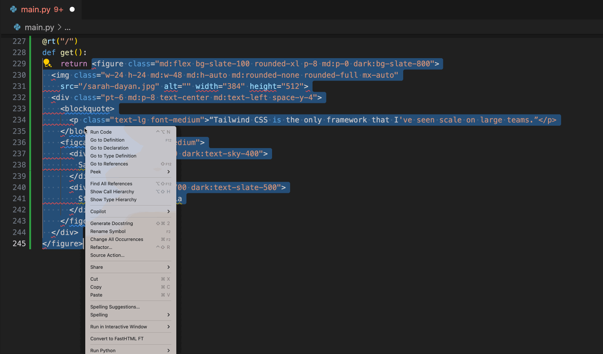

  

<h1 align="center">HTML2FT</h1>

This extension converts HTML code to FT Python code to use with FastHTML

## Extension Settings

- attributes VS children first

## Credits

- logo designed by DallE

## Release Notes

Users appreciate release notes as you update your extension.

### 0.1.0

Initial release

### 0.2.0

Run conversion locally 

### 0.3.0

Support extension settings

### 0.4.0

New converter

### 0.5.0

Relax VS code version requirements

### 0.6.0

Improve SVG handling

### 0.7.0

Improve code formatting

## 0.8.0

- Correctly parse alpinejs attrs like `x-transition.opacity.duration.600ms`
- Group kw args into 1 dictionary `Div(**{'x-transition.opacity.duration.600ms': True},  **{'x-transition.scale.origin.top': True})` becomes `Div(**{'x-transition.opacity.duration.600ms': True, 'x-transition.scale.origin.top': True})`

## Release flow

- local build (for testing): `npm upgrade && pnpm vsce package`
- create a tag (e.g. `git tag 0.6.2`)
- `git push origin --tags`
