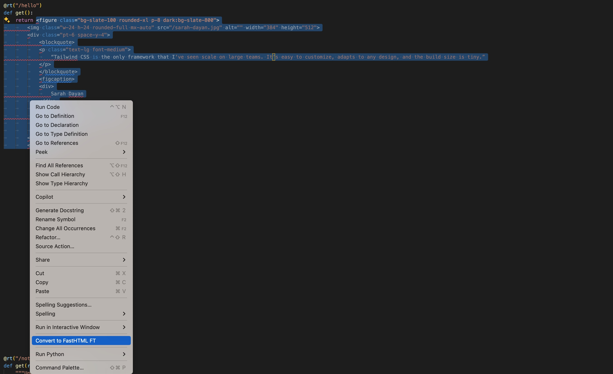

# HTML2FT

This extension converts HTML code to FT Python code to use with FastHTML

## Requirements

None

## Extension Settings

No settings at the moment

## Known Issues

N/A

## Release Notes

Users appreciate release notes as you update your extension.

### 0.1.0

Initial release

### 0.2.0

Run conversion locally 
